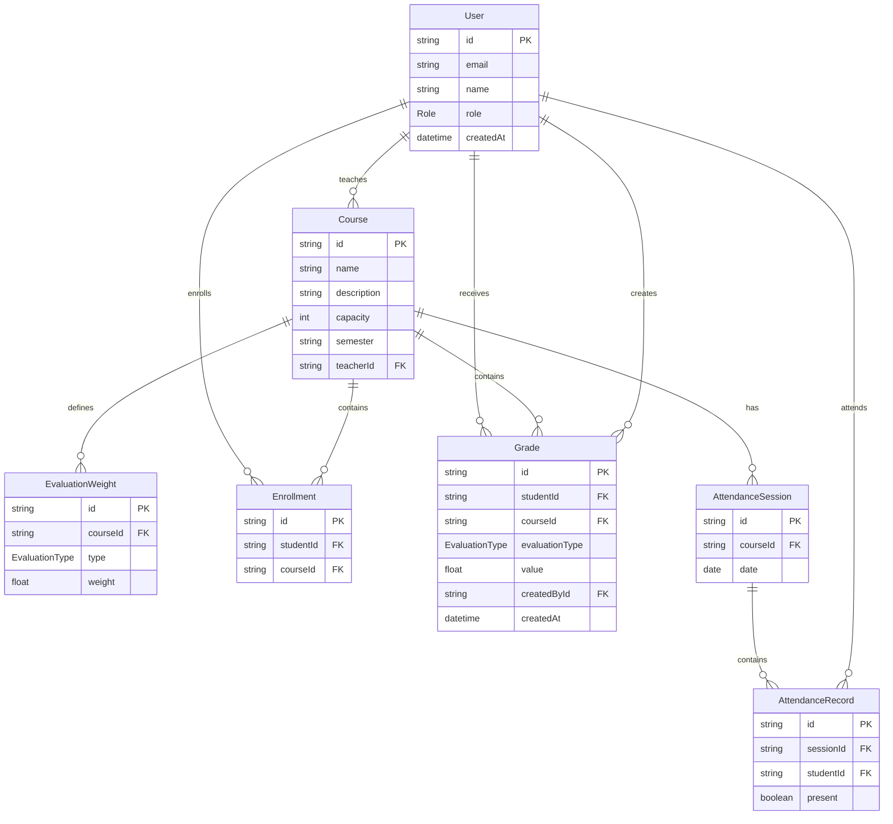

# track-api

```mermaid
erDiagram

    User {
        string id PK
        string email
        string name
        Role role
        datetime createdAt
    }

    Course {
        string id PK
        string name
        string description
        int capacity
        string semester
        string teacherId FK
    }

    EvaluationWeight {
        string id PK
        string courseId FK
        EvaluationType type
        float weight
    }

    Enrollment {
        string id PK
        string studentId FK
        string courseId FK
    }

    Grade {
        string id PK
        string studentId FK
        string courseId FK
        EvaluationType evaluationType
        float value
        string createdById FK
        datetime createdAt
    }

    AttendanceSession {
        string id PK
        string courseId FK
        date date
    }

    AttendanceRecord {
        string id PK
        string sessionId FK
        string studentId FK
        boolean present
    }

    User ||--o{ Course : teaches
    User ||--o{ Enrollment : enrolls
    Course ||--o{ Enrollment : contains

    Course ||--o{ EvaluationWeight : defines

    User ||--o{ Grade : receives
    Course ||--o{ Grade : contains
    User ||--o{ Grade : creates

    Course ||--o{ AttendanceSession : has
    AttendanceSession ||--o{ AttendanceRecord : contains
    User ||--o{ AttendanceRecord : attends
```