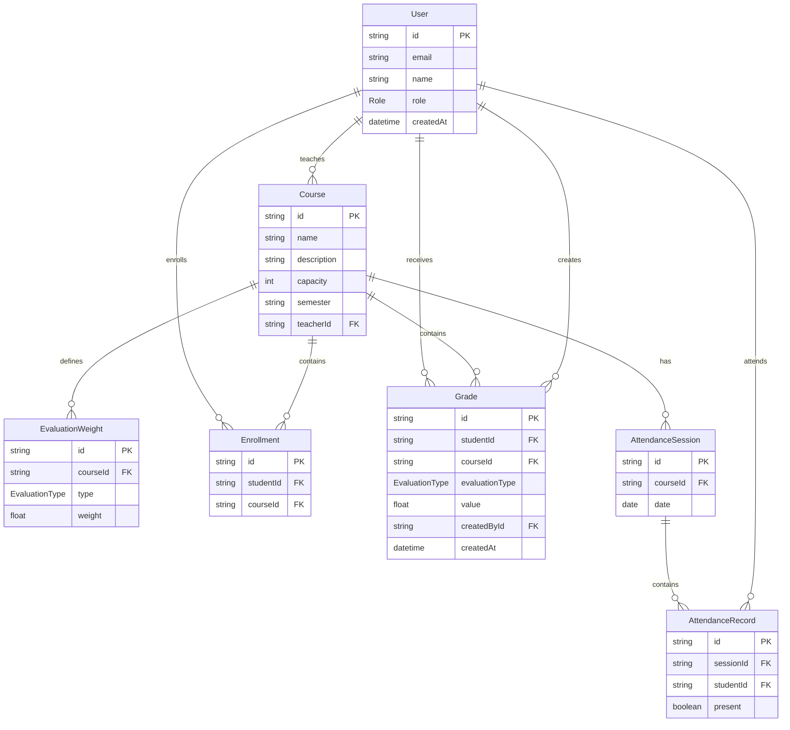

# track-api



### Create an admin user

```bash
npm run create:admin -- admin@example.com supersecret "Admin Name"
```

### Quickstart

- **API docs (Swagger):** visit `http://localhost:3000/api/docs` after starting the server.
- **Repository API:** See `api/README.md` for full setup and runtime instructions.

### Docker stack

Start API + Postgres + Redis + Loki + Grafana:

```bash
docker compose up --build -d
```

Then open:

- API: `http://localhost:3000`
- Swagger: `http://localhost:3000/api/docs`
- Grafana: `http://localhost:3001` (admin/admin)
